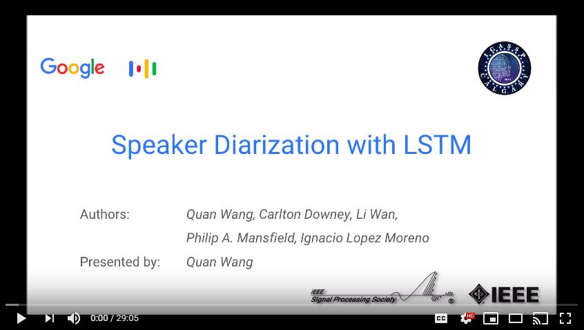

# Spectral Clustering
[](https://travis-ci.org/wq2012/SpectralCluster)  [](https://pypi.python.org/pypi/spectralcluster) [](https://pypi.org/project/spectralcluster) [](https://pepy.tech/project/spectralcluster) [](https://codecov.io/gh/wq2012/SpectralCluster) [](https://wq2012.github.io/SpectralCluster)

## Overview

This is a Python re-implementation of the spectral clustering algorithm in the
paper [Speaker Diarization with LSTM](https://google.github.io/speaker-id/publications/LstmDiarization/).


## Disclaimer

**This is not the original implementation used by the paper.**

Specifically, in this implementation, we use the K-Means from
[scikit-learn](https://scikit-learn.org/stable/modules/generated/sklearn.cluster.KMeans.html),
which does NOT support customized distance measure like cosine distance.

## Dependencies

* numpy
* scipy
* scikit-learn

## Installation

Install the [package](https://pypi.org/project/spectralcluster/) by:

```bash
pip3 install spectralcluster
```

or

```bash
python3 -m pip install spectralcluster
```

## Tutorial

Simply use the `predict()` method of class `SpectralClusterer` to perform
spectral clustering:

```python
from spectralcluster import SpectralClusterer

clusterer = SpectralClusterer(
    min_clusters=2,
    max_clusters=100,
    p_percentile=0.95,
    gaussian_blur_sigma=1)

labels = clusterer.predict(X)
```

The input `X` is a numpy array of shape `(n_samples, n_features)`,
and the returned `labels` is a numpy array of shape `(n_samples,)`.

For the complete list of parameters of the clusterer, see
`spectralcluster/spectral_clusterer.py`.

[](https://youtu.be/pjxGPZQeeO4)

## Citations

Our paper is cited as:

```
@inproceedings{wang2018speaker,
  title={Speaker diarization with lstm},
  author={Wang, Quan and Downey, Carlton and Wan, Li and Mansfield, Philip Andrew and Moreno, Ignacio Lopz},
  booktitle={2018 IEEE International Conference on Acoustics, Speech and Signal Processing (ICASSP)},
  pages={5239--5243},
  year={2018},
  organization={IEEE}
}
```

## FAQs

### Laplacian matrix

**Question:** Why are you performing eigen-decomposition directly on the similarity matrix instead of its Laplacian matrix? ([source](https://ieeexplore.ieee.org/stamp/stamp.jsp?tp=&arnumber=9053122))

**Answer:** No, we are not performing eigen-decomposition directly on the similarity matrix. In the sequence of refinement operations, the first operation is `CropDiagonal`, which replaces each diagonal element of the similarity matrix by the max non-diagonal value of the row. After this operation, the matrix has similar properties to a standard Laplacian matrix.

**Question:** Why don't you just use the standard Laplacian matrix?

**Answer:** Our Laplacian matrix is less sensitive (thus more robust) to the Gaussian blur operation.

### Cosine vs. Euclidean distance

**Question:** Your paper says the K-Means should be based on Cosine distance, but this repository is using Euclidean distance. Do you have a Cosine distance version?

**Answer:** You can find a variant of this repository using Cosine distance for K-means instead of
Euclidean distance here:
[FlorianKrey/DNC](https://github.com/FlorianKrey/DNC)

## Misc

Our new speaker diarization systems are now fully supervised, powered by
[uis-rnn](https://github.com/google/uis-rnn).
Check this [Google AI Blog](https://ai.googleblog.com/2018/11/accurate-online-speaker-diarization.html).

To learn more about speaker diarization, here is a curated list of resources:
[awesome-diarization](https://github.com/wq2012/awesome-diarization).
